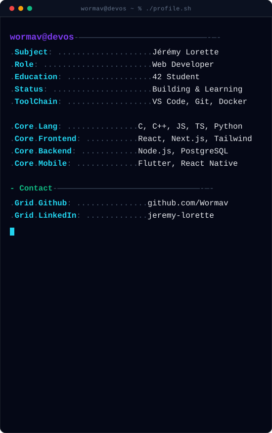

<h3><code>wormav@github ~ $ whoami</code></h3>

<table>
<tr>
<!-- Tu devras générer ces images via les scripts de AVIVASHISHTA29, ou utiliser des images statiques en attendant -->
<td valign="top"></td>
<td valign="top"></td>
</tr>
</table>

 
 

<h3><code>wormav@github ~ $ ./contributions.sh</code></h3>

<!-- L'image de contribution animée générée par les actions GitHub -->

 
 

<h3><code>wormav@github ~ $ ./links.sh</code></h3>

<b>Web Developer · 42 Student</b>

 
 

<h3><code>wormav@github ~ $ ./skills.sh</code></h3>

 

  

  

  

